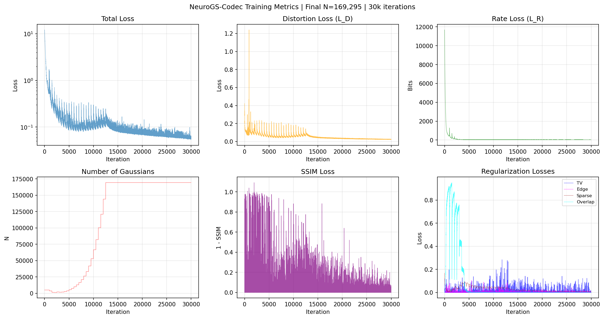
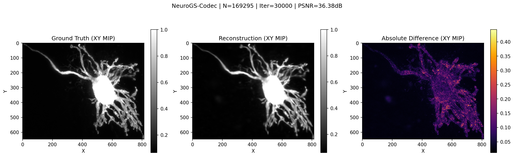
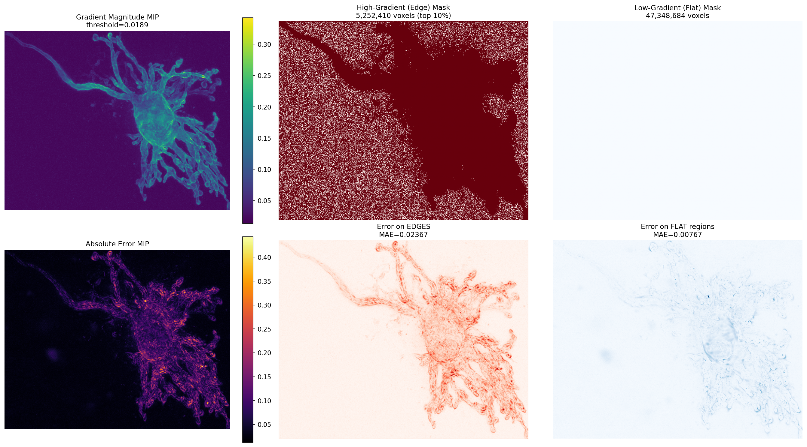

# NeuroGS-Codec

A neural codec for 3D microscopy volume compression using anisotropic 3D Gaussian mixture representations.

## Overview

NeuroGS-Codec represents volumetric data (e.g., neuron microscopy) as a sparse mixture of anisotropic 3D Gaussians optimized via rate-distortion training. This enables high-fidelity compression while preserving fine geometric structures like dendrites and axons.

## Method

### Implicit Volume Representation

We represent a normalized volumetric signal `V(x)` using a weighted sum of Gaussian basis functions:

```
f(x) = Σᵢ aᵢ · Gᵢ(x; μᵢ, Σᵢ) + b
```

where each anisotropic Gaussian is:

```
Gᵢ(x) = exp(-½ (x - μᵢ)ᵀ Σᵢ⁻¹ (x - μᵢ))
```

**Parameterization** (for stable optimization):
- **Mean**: `μᵢ ∈ ℝ³` (Gaussian center)
- **Covariance**: `Σᵢ = R(qᵢ) · diag(sᵢ²) · R(qᵢ)ᵀ` where:
  - `R(qᵢ)` is a rotation matrix from unit quaternion `qᵢ`
  - `sᵢ = exp(ℓᵢ)` are axis scales (log-parameterized)
- **Amplitude**: `aᵢ ∈ ℝ` (contribution weight)
- **Bias**: `b ∈ ℝ` (global offset)

### Training Objective

The total loss combines distortion and rate with geometric regularizers:

```
L_total = L_D + λ·L_R + α·L_T + β_TV·L_TV + β_SSIM·L_SSIM + β_Edge·L_Edge + β_S·L_S + β_Sm·L_Sm + β_O·L_O
```

#### Loss Components

| Term | Description |
|------|-------------|
| **L_D** | Geometry-weighted Charbonnier distortion (robust to outliers, emphasizes neurites/edges) |
| **L_R** | Rate proxy via Laplace entropy model on quantized parameters |
| **L_T** | Topology-biased patch loss for neurite continuity |
| **L_TV** | Total variation for piecewise-smooth geometry |
| **L_SSIM** | 3D SSIM for structural similarity |
| **L_Edge** | Edge-aware reconstruction loss for boundary alignment |
| **L_S** | ℓ₁ sparsity on amplitudes (fewer active Gaussians) |
| **L_Sm** | Scale/shape constraints (prevent degenerate covariances) |
| **L_O** | Overlap penalty via Mahalanobis distance (reduce redundancy) |

### Adaptive Densification

During training, Gaussians are dynamically added/removed:
- **Split**: Large Gaussians with high gradient → split into smaller ones
- **Clone**: Small Gaussians with high gradient → duplicate for local capacity
- **Prune**: Remove low-amplitude or oversized Gaussians

## Results

| Metric | Value |
|--------|-------|
| **PSNR** | 36.38 dB |
| **3D SSIM** | 0.921 |
| **MAE** | 0.0093 |
| **Gaussians** | 169,295 |
| **Training** | 30k iterations |

### Training Metrics



*Training curves showing loss convergence and Gaussian count evolution over 30k iterations.*

### XY Projection (MIP)



*Left: Ground truth, Center: Reconstruction, Right: Absolute difference*

### Error Analysis



Gradient-based edge analysis (90th percentile):
- **Edge MAE**: 0.0237 (top 10% gradient voxels)
- **Flat MAE**: 0.0077 (remaining 90%)
- **Ratio**: 3.1× (edge errors dominate → Gaussians blur boundaries)

## Setup

### Prerequisites

- **CUDA-capable GPU** (tested on NVIDIA GPUs with CUDA 12.1)
- **Conda** (Miniconda or Anaconda)
- **Git**

### Installation

```bash
# 1. Clone repository
git clone https://github.com/asheibanifard/neurogs.git
cd neurogs

# 2. Create conda environment (CUDA 12.1 + PyTorch 2.3)
conda env create -f environmet.yml
conda activate neurogs

# 3. Set CUDA environment variables (add to ~/.bashrc for persistence)
export CUDA_HOME=$CONDA_PREFIX
export LD_LIBRARY_PATH=$CONDA_PREFIX/lib:$LD_LIBRARY_PATH
export TORCH_CUDA_ARCH_LIST="6.0 6.1 7.0 7.5 8.0 8.6 8.9 9.0"
```

### Alternative: Pip Installation (minimal)

```bash
# Create virtual environment
python -m venv venv
source venv/bin/activate

# Install dependencies
pip install torch torchvision --index-url https://download.pytorch.org/whl/cu121
pip install tifffile matplotlib numpy scipy tqdm pillow
```

### Verify Installation

```python
import torch
print(f"PyTorch: {torch.__version__}")
print(f"CUDA available: {torch.cuda.is_available()}")
print(f"GPU: {torch.cuda.get_device_name(0)}")
```

## Running the Model

### 1. Prepare Your Data

Place your 3D microscopy volume (TIF format, shape `[Z, Y, X]`) in the project directory:

```bash
# Expected: 3D TIF file with shape (depth, height, width)
ls *.tif
# Example: 10-2900-control-cell-05_cropped_corrected.tif
```

### 2. Training

#### Option A: Interactive Notebook (Recommended for exploration)

```bash
jupyter notebook NeuroGS_Codec_Starter.ipynb
```

#### Option B: Standalone Script (Recommended for long training)

```bash
# Direct execution
python train_standalone.py

# Detached execution (survives SSH disconnect)
tmux new -s train
python train_standalone.py
# Detach: Ctrl+B, then D
# Reattach: tmux attach -t train

# Or with nohup
nohup python train_standalone.py > training.log 2>&1 &
tail -f training.log  # Monitor progress
```

#### Training Configuration

Edit `train_standalone.py` to customize:

```python
# Input volume
TIF_PATH = "your_volume.tif"
VOXEL_SPACING = (0.126, 0.126, 1.0)  # (dx, dy, dz) in microns

# Training
TRAINING_CONFIG = {
    "N0": 5000,              # Initial Gaussians
    "steps": 30000,          # Training iterations
    "batch": 2000,           # Points per iteration
    "kappa": 8.0,            # Neurite emphasis weight
    "lam": 0.001,            # Rate weight (↑ = more compression)
    "beta_sparse": 0.003,    # Sparsity regularization
    "beta_tv": 0.002,        # Total variation smoothness
    "beta_ssim": 0.1,        # Structural similarity weight
    "beta_edge": 0.05,       # Edge preservation weight
}
```

### 3. Monitoring Training

Checkpoints are saved every 1000 iterations to `checkpoints/`:

```bash
ls checkpoints/
# neurogs_codec_ckpt_1000.pt
# neurogs_codec_ckpt_2000.pt
# ...
# neurogs_codec_ckpt_final.pt
```

### 4. Visualization

```bash
# Generate XY projection comparison (GT vs Reconstruction)
python visualise.py

# Generate edge vs flat region error analysis
python plot_edge_analysis.py
```

Output images:
- `xy_projection.png` - Side-by-side comparison
- `edge_analysis.png` - Error distribution analysis

### 5. Loading a Trained Model

```python
import torch
from gaussian_model import GaussianMixtureVolume

# Load checkpoint
ckpt = torch.load("checkpoints/neurogs_codec_ckpt_final.pt")

# Reconstruct model
model = GaussianMixtureVolume(
    n_gaussians=ckpt["means"].shape[0],
    mean_init=ckpt["means"],
    log_scale_init=ckpt["log_scales"],
    quat_init=ckpt["quats"],
    amp_init=ckpt["amps"],
)
model.bias.data = ckpt["bias"]
model.eval()

# Reconstruct volume at any resolution
coords = ...  # Your query coordinates, shape [N, 3], normalized to [-1, 1]
with torch.no_grad():
    values = model(coords)
```

### Configuration

Key hyperparameters in `train_standalone.py`:

```python
TRAINING_CONFIG = {
    "N0": 5000,              # Initial number of Gaussians
    "steps": 30000,          # Training iterations
    "batch": 2000,           # Sample points per iteration
    "kappa": 8.0,            # Neurite map emphasis weight
    "lam": 0.001,            # Rate weight (higher = more compression)
    "beta_sparse": 0.003,    # ℓ₁ sparsity on amplitudes
    "beta_tv": 0.002,        # Total variation smoothness
    "beta_ssim": 0.1,        # 3D SSIM structural loss
    "beta_edge": 0.05,       # Edge-aware reconstruction
    "beta_sm": 0.001,        # Scale regularization
    "beta_overlap": 0.0005,  # Overlap penalty
}
```

## Troubleshooting

### CUDA Out of Memory

```python
# Reduce batch size in train_standalone.py
"batch": 1000,  # Default: 2000

# Or reduce max Gaussians
"max_gaussians": 100000,  # Default: 150000
```

### nvcc Not Found

```bash
conda install -c conda-forge cuda-toolkit=12.1
export CUDA_HOME=$CONDA_PREFIX
```

### PyTorch Not Using GPU

```bash
# Verify CUDA installation
python -c "import torch; print(torch.cuda.is_available())"

# Check GPU visibility
nvidia-smi
```

### Training Too Slow

- Ensure GPU is being used (check `nvidia-smi` during training)
- Reduce volume resolution for initial experiments
- Use `tmux` or `nohup` for long training sessions

## Files

```
neurogs/
├── NeuroGS_Codec_Starter.ipynb  # Main interactive notebook
├── train_standalone.py           # Detached training script
├── visualise.py                  # XY projection visualization
├── plot_edge_analysis.py         # Edge vs flat error analysis
├── gaussian_model.py             # Model definitions
├── checkpoints/                  # Saved checkpoints
├── reports/
│   └── r1.tex                    # LaTeX documentation
└── utils/
    ├── general_utils.py
    ├── graphics_utils.py
    └── sh_utils.py
```

## Citation

```bibtex
@article{neurogs2026,
  title={NeuroGS-Codec: Neural Compression of 3D Microscopy Volumes via Gaussian Mixture Representations},
  author={},
  year={2026}
}
```

## License

MIT License